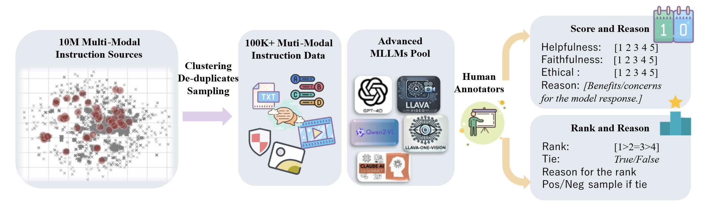

<p align="center" width="100%">

</p>

<font size=7><div align='center' >  
[[📖 arXiv Paper](https://arxiv.org/abs/2406.08487)] 
[[📊 MM-RLHF Data](https://huggingface.co/datasets/yifanzhang114/MM-RLHF)] 
[[📝 Homepage](https://mm-rlhf.github.io/)] 

[[🏆 Reward Model](https://huggingface.co/yifanzhang114/MM-RLHF-Reward-7B-llava-ov-qwen)] 
[[🔮 MM-RewardBench](https://huggingface.co/datasets/yifanzhang114/MM-RLHF-RewardBench)] 
[[🔮 MM-SafetyBench](https://github.com/yfzhang114/mmrlhf-eval)] 
[[📈 Evaluation Suite](https://github.com/yfzhang114/mmrlhf-eval)] 
</div></font>

# The Next Step Forward in Multimodal LLM Alignment

**[2025/02/27]** 🔥 MM-RLHF is now fully supported by [swift](https://github.com/modelscope/ms-swift). Simply process your data using ```scripts/convert_to_swift.py``` and execute the ```scripts/swift.sh``` command to get started.

**[2025/02/10]** 🔥 We are proud to open-source **MM-RLHF**, a comprehensive project for aligning Multimodal Large Language Models (MLLMs) with human preferences. This release includes:

- A **high-quality MLLM alignment dataset**.
- A **strong Critique-Based MLLM reward model** and its training algorithm.
- A **novel alignment algorithm MM-DPO**.
- **Two new benchmarks**.

Our dataset and algorithms enable consistent performance improvements across **10 dimensions** and **27 benchmarks** for open-source MLLMs.

### **Key Components**

#### 1. **MM-RLHF Dataset** (```data.jsonl``` in [MM-RLHF Data](https://huggingface.co/datasets/yifanzhang114/MM-RLHF))
- **20k instructions** covering **image understanding**, **video understanding**, and **safety-related tasks**.
- Each instruction includes **3-5 model-generated responses**, along with **human-annotated scores**, **rankings**, and **fine-grained textual feedback**.
- **80k comparison pairs** derived from ranked samples for each instruction, suitable for RLHF training.


#### 2. **Critique-Based MLLM Reward Model**
- We release the **MM-RLHF-Reward-7B**, a **Critique-Based Reward Model** that generates critiques of candidate texts before assigning scores, offering enhanced interpretability and more informative feedback.
- Includes the **training algorithm** for the reward model, enabling researchers to reproduce and extend our work.

#### 3. **MM-DPO Algorithm**
- Complete training code for **MM-DPO**, a novel alignment algorithm that achieves significant performance gains with simple adjustments to the DPO framework.

#### 4. **MM-RLHF Benchmarks**
- **MM-RLHF-RewardBench**: Evaluates the quality of reward models.
- **MM-RLHF-SafetyBench**: Focuses on MLLM safety, including tasks like **adversarial attacks**, **red teaming**, **jailbreaking**, and **harmful content detection**.


## Models & Scripts

### Installation


#### 1. **Clone this repository and navigate to the LLaVA folder:**
```bash
git clone https://github.com/yfzhang114/MM-RLHF
cd MM-RLHF
```

**Install the inference package:**
```bash
conda create -n llava python=3.10 -y
conda activate llava
pip install --upgrade pip  # Enable PEP 660 support.
pip install -e .
pip install -e ".[train]"
pip install flash-attn --no-build-isolation
```

#### 2. Data Preparation

Download [📊 MM-RLHF Data](https://huggingface.co/datasets/yifanzhang114/MM-RLHF), unzip the image and video datasets, and the final structure should look like this:

```
MM-RLHF
-- | long
-- | mcq
-- | safety
-- | short
-- | data.jsonl
-- | dpo_pairs.jsonl
```

Here, `data.jsonl` contains all labeled information, and `dpo_pairs.jsonl` contains pairs of different ranks used for subsequent DPO and reward model training. The other folders contain the image and video frames.

#### 3. **Critique-Based MLLM Reward Model:**

Specify the model to learn the critic and provide the reward's loss weight, such as `critic_rewards_weight` and `float_rewards_weight`.

```bash
sh scripts/train/critic_reward_7b.sh
```

#### 4. MM-DPO Training:

**Step 1**: Precompute Logits with Reference Model

To save GPU memory during DPO training, precompute logits using the reference model. Specify `DATA_PATH` and `OUTPUT_DATA_PATH` in the script.

```bash
sh scripts/train/generate_ref_logits.sh
```

The output file will add elements like "reference_chosen_logp" and "reference_rejected_logp" to the data.

**Step 2**: Run DPO Algorithm with Precomputed Logits
```bash
sh scripts/train/dpo_ov7b.sh
```


#### 5. Evaluation

For **alignment models**, the evaluation code is available in the [mmrlhf-eval repository](https://github.com/yfzhang114/mmrlhf-eval). This code provides various evaluation tasks that test the alignment capabilities of your model across multiple benchmarks. These benchmarks include standard tests for model robustness, safety, and hallucination handling in multimodal contexts.

For **reward models**, we offer the **MM-RLHF-RewardBench** (available on Hugging Face at [MM-RLHF-RewardBench](https://huggingface.co/datasets/yifanzhang114/MM-RLHF-RewardBench)) for detailed evaluation. To perform the evaluation, download the required images and the `mm_reward_bench.jsonl` file from the repository and place them in the appropriate directories. Then, follow these steps:

1. **Download the dataset** and necessary files:
   - Ensure the repository contains the image data and the `mm_reward_bench.jsonl` file in the designated folder (`path_to_data/`).
   
2. **Run the reward model evaluation**:
   This step involves evaluating the reward model against the dataset by running the following command:
   ```bash
   python llava/eval/eval_mm_reward_bench.py --model-path your_reward_model --question-file path_to_data/mm_reward_bench.jsonl --answers-file your_answer_file
   ```

3. **Calculate performance metrics**:
   After generating the answer file, you can calculate the performance of your reward model by running the following command:
   ```bash
   python llava/eval/cal_performance_mmreward_bench.py --input_file your_answer_file
   ```
   
## Citation

If you find it useful for your research and applications, please cite related papers/blogs using this BibTeX:
```bibtex
@article{zhang2025mm,
  title={MM-RLHF: The Next Step Forward in Multimodal LLM Alignment},
  author={Zhang, Yi-Fan and Yu, Tao and Tian, Haochen and Fu, Chaoyou and Li, Peiyan and Zeng, Jianshu and Xie, Wulin and Shi, Yang and Zhang, Huanyu and Wu, Junkang and others},
  journal={arXiv preprint arXiv:2502.10391},
  year={2025}
}
```

## Related Projects

- [MME-RealWorld: Could Your Multimodal LLM Challenge High-Resolution Real-World Scenarios that are Difficult for Humans?](https://github.com/yfzhang114/MME-RealWorld)
- [MME-Survey: A Comprehensive Survey on Evaluation of Multimodal LLMs](https://arxiv.org/abs/2411.15296)
- [Beyond LLaVA-HD: Diving into High-Resolution Large Multimodal Models](https://github.com/yfzhang114/SliME)
- [VITA-1.5: Towards GPT-4o Level Real-Time Vision and Speech Interaction](https://github.com/VITA-MLLM/VITA)
